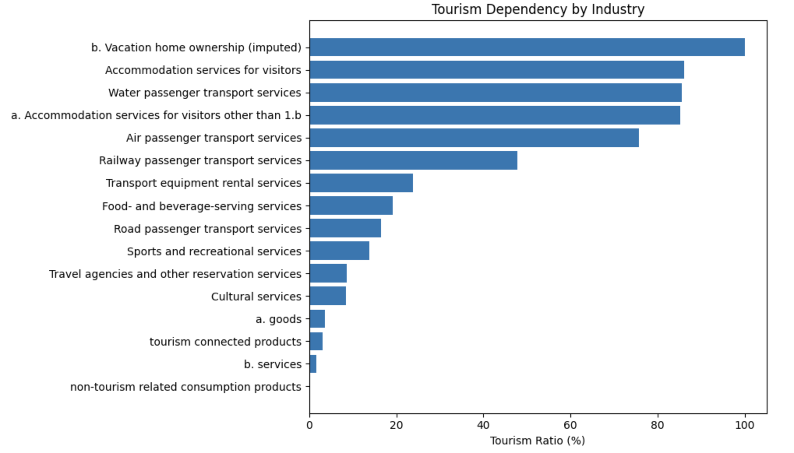
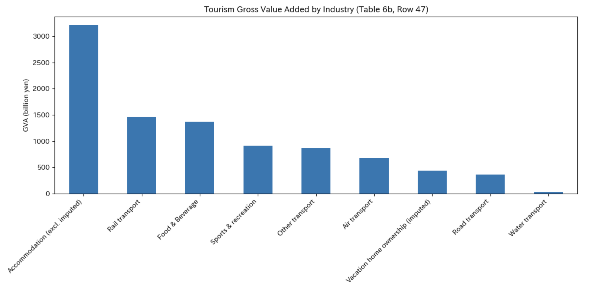
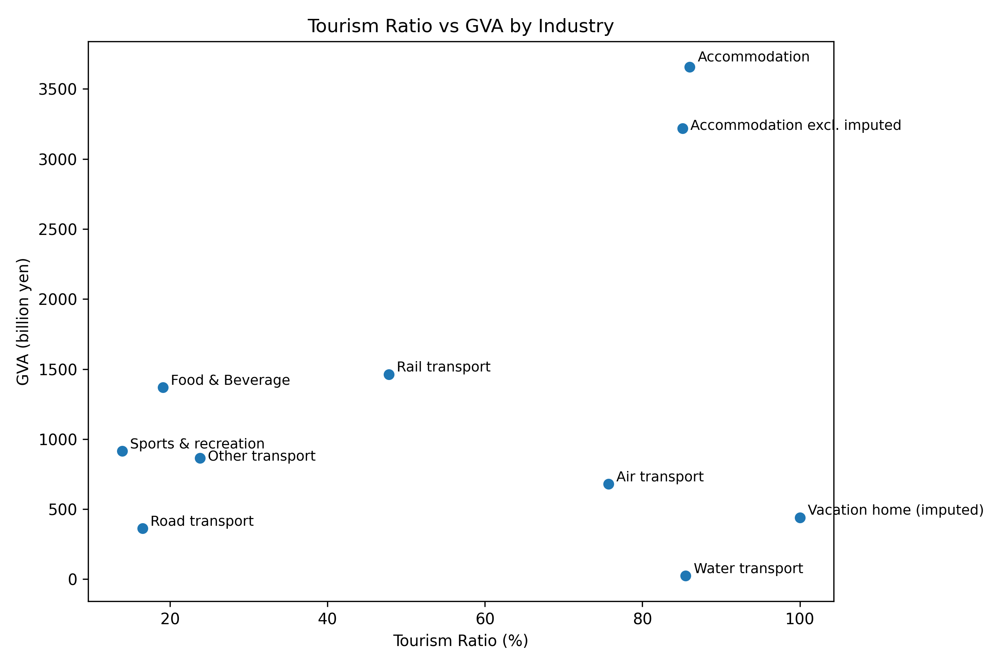
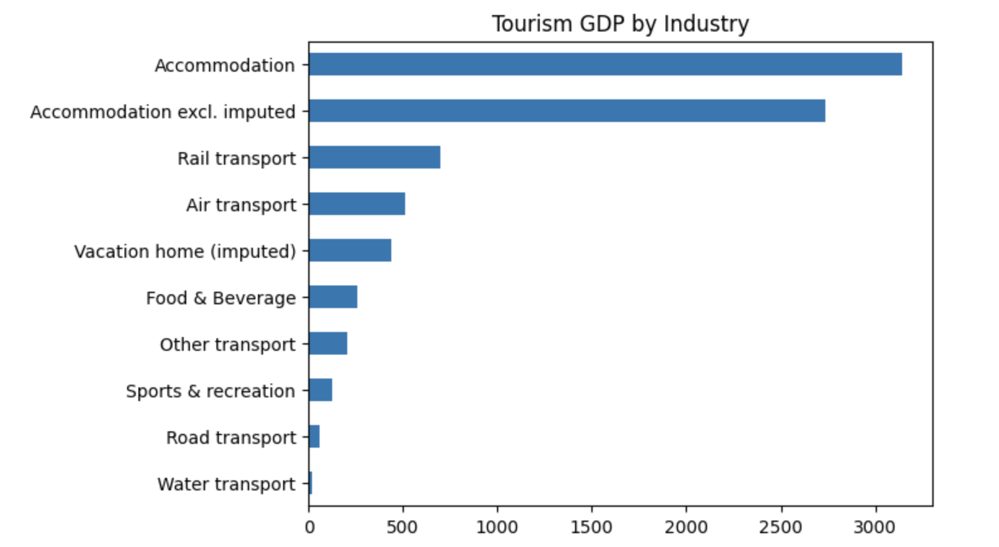

# Tourism Satellite Account Analysis of Japan 2023

## Overview
This project analyzes Japan’s tourism economy using the Tourism Satellite Account (TSA) for 2023.

## Research Questions
- Which tourism products account for the largest share of tourism consumption in Japan?
- How is tourism spending distributed across tourism-related industries?
- What is the structure of inbound vs domestic tourism consumption?

## Data Source
Japan Tourism Agency (JTA)
Tourism Satellite Account (TSA) Tables 2023

Available at: https://www.mlit.go.jp/kankocho/tokei_hakusyo/tsa.html

GVA (Value Added)
→ Value generated by each industry

GDP
→ Total GVA + Taxes - Subsidies

GDP = ΣGVA + (Taxes - Subsidies)

GVA (Gross Value Added) represents the value created by each industry, and Tourism GDP represents the portion of GVA generated by tourism demand across industries.

## Key Findings
Accommodation shows both high GVA and high tourism dependency, acting as the core tourism industry.
Some industries (e.g., rail transport, food & beverage) have large economic size but only moderate tourism dependency.
Others (e.g., air transport, vacation homes) show high tourism dependency despite smaller economic size.

The correlation between GVA and tourism ratio is low (0.27), indicating a weak relationship.
Industry size and tourism dependency are largely independent.

## Tourism-dependent industries
The figure below shows the tourism ratio across major tourism-related industries.
Accommodation and passenger transport services show the highest tourism ratios, indicating strong dependence on tourism demand.  
By contrast, cultural and reservation-related services exhibit relatively lower tourism dependence.

### Tourism Dependency by Industry

These results highlight that accommodation and passenger transport are the most tourism-dependent sectors in the economy.

### Tourism GVA by Industry

This chart shows tourism gross value added (GVA) by industry based on Japan's Tourism Satellite Account (Table 6b).  
Accommodation generates the largest share of value, followed by food services and transport, indicating that tourism value creation is concentrated in these sectors.

###  Tourism ratio vs GVA

Accommodation
→ The core of tourism demand, with the largest scale and highest dependency.

Rail transport
→ A hybrid structure supported by both domestic and tourism demand.

Air transport
→ Highly dependent on tourism, but with relatively limited economic scale.

Water transport
→ Highly tourism-dependent but extremely small in scale (outlier).

### Tourism GDP by Industry

Tourism GDP is highly concentrated in the accommodation sector, with transport playing a secondary role.
